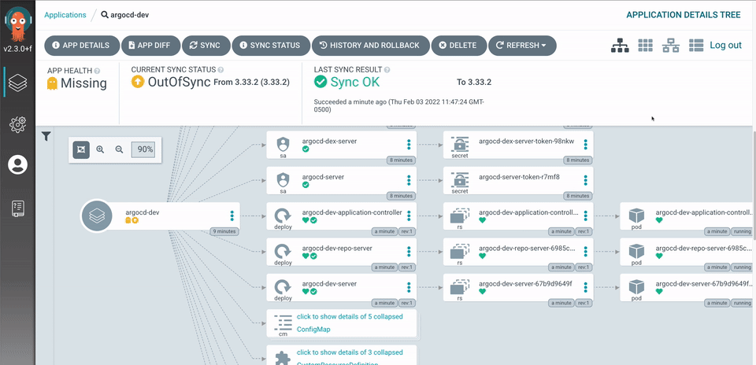

# 1.什么是Argo CD？
Argo CD 是 Kubernetes 的声明式 GitOps 持续交付工具。

# 2.为什么选择Argo CD？
应用程序的定义、配置和环境变量应该是声明性的，并且进行版本控制。应用程序的部署和生命周期管理应该是自动化的、可审计的且易于理解。
# 3. 入门
## 3.1 快速安装
```shell
kubectl create namespace argocd
kubectl apply -n argocd -f https://raw.githubusercontent.com/argoproj/argo-cd/stable/manifests/install.yaml
```
入门请参考[入门指南](../4.入门指南/4.入门指南.md)，更多功能了解请参考[用户指南]，升级请参考[升级指南]，开发者请参考[开发者指南]。
# 4.运行机制
Argo CD 遵循GitOps模式，使用 Git 存储库作为定义所需应用程序状态的事实来源。可以通过以下方法指定 Kubernetes manifests。
* kustomize applications
* helm charts
* jsonnet files
* YAML/json manifests文件目录
* 任意的自定义配置管理工具插件
Argo CD 可在指定的目标环境中自动部署指定状态的应用程序。应用程序的部署可以根据分支，tags,或者指定版本的提交进行跟踪更新。更多的跟踪策略细节请参阅[跟踪策略]。
# 5.架构

Argo CD 被实现为 kubernetes 控制器，它持续监控正在运行的应用程序，并将当前的实时状态与所需的目标状态（如 Git 存储库中指定的）进行比较。其实时状态偏离目标状态的已部署应用程序视为OutOfSync。Argo CD 报告并可视化差异，同时提供自动或手动将实时状态同步回所需目标状态的工具。对 Git 存储库中所需目标状态所做的任何修改都可以自动应用并反映在指定的目标环境中。
有关更详细的架构介绍，请参阅[架构概述]。
# 6.重要功能点
* 自动将应用程序部署到指定的目标环境
* 支持多种配置管理/模板工具（Kustomize、Helm、Jsonnet、plain-YAML）
* 能够管理和部署到多个集群
* SSO 集成（OIDC、OAuth2、LDAP、SAML 2.0、GitHub、GitLab、Microsoft、LinkedIn）
* 多租户和 RBAC 授权策略
* 回滚/回滚到 Git 存储库中提交的任何应用程序配置
* 应用资源健康状况分析
* 自动配置漂移检测和可视化
* 自动或手动将应用程序同步到所需状态
* Web UI 提供应用程序活动的实时视图
* 用于自动化和 CI 集成的 CLI
* Webhook 集成（GitHub、BitBucket、GitLab）
* 用于自动化的访问令牌
* PreSync、Sync、PostSync hook，支持复杂的应用程序部署（例如蓝/绿和金丝雀升级）
* 应用程序事件和 API 调用的审核跟踪
* 普罗米修斯指标
* 参数覆盖用于覆盖 Git 中的 helm 参数

# 7.发展现状
Argo CD 正在由社区积极开发。Releases可以在[这里](https://github.com/argoproj/argo-cd/releases)找到。
# 8.采用
已正式采用 Argo CD 的组织可以在[这里](https://github.com/argoproj/argo-cd/blob/master/USERS.md)找到。