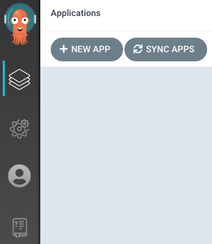
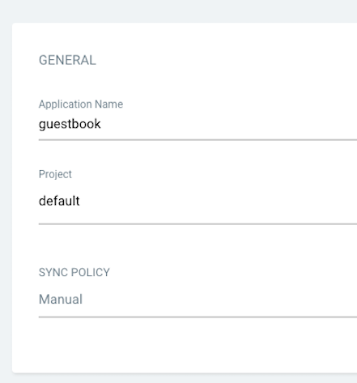
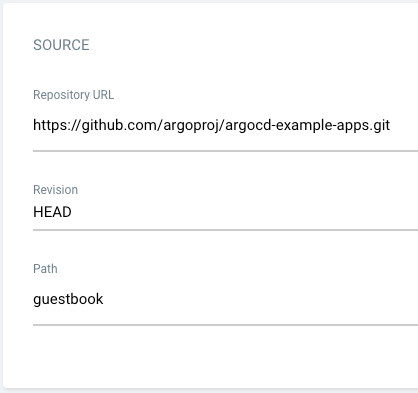
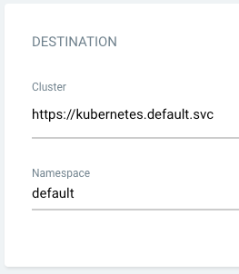
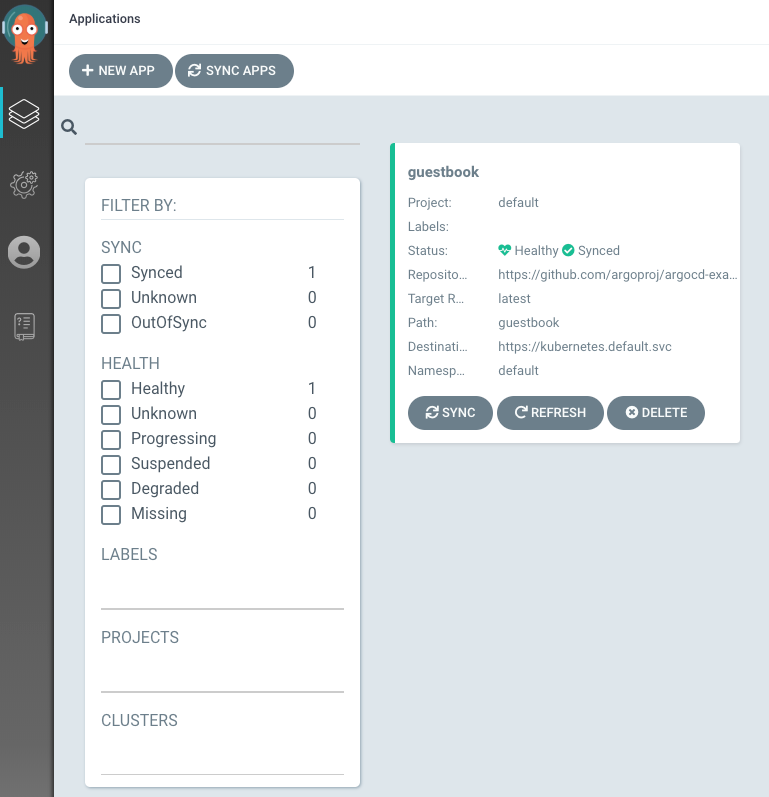
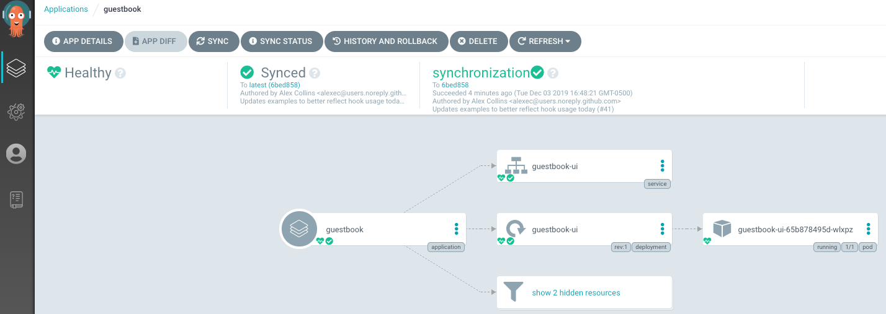

>Tip:
>本指南假设您对 Argo CD 所基于的工具有一定的了解。请阅读[了解基础知识](../2.了解基础知识/2.了解基础知识.md)以了解这些工具。
# 前提条件
* 安[kubectl](https://kubernetes.io/docs/tasks/tools/)命令行工具。
* 有一个[kubeconfig](https://kubernetes.io/docs/tasks/access-application-cluster/configure-access-multiple-clusters/)文件（默认位置是~/.kube/config）。
* CoreDNS。可以通过以下方式为 microk8s 启用`microk8s enable dns && microk8s stop && microk8s start`。
# 1. 安装Argo CD
```
kubectl create namespace argocd
kubectl apply -n argocd -f https://raw.githubusercontent.com/argoproj/argo-cd/stable/manifests/install.yaml
```
创建一个名为argocd的命名空间，并在这个命名空间中创建argcd的服务应用程序等。
>Warning:
>部署的manifest中包含的ClusterRoleBinding引用的资源所属namespace为argcd，如果将argocd安装到非argocd的命名空间需要做对应修改。

如果您对 UI、SSO、多集群功能不感兴趣，那么您可以仅安装Argo CD核心组件：
```
kubectl create namespace argocd
kubectl apply -n argocd -f https://raw.githubusercontent.com/argoproj/argo-cd/stable/manifests/core-install.yaml
```
此默认安装将具有自签名证书，如果没有一些额外的工作就无法访问。执行以下操作之一：

* 按照[说明配置证书]（并确保客户端操作系统信任它）。
* 配置客户端操作系统以信任自签名证书。
* 在本指南中的所有 Argo CD CLI 操作上使用 --insecure 参数。

用于argocd login --core配置CLI 访问并[跳过]步骤 3-5。
# 2. 下载Argo CD CLI
[从https://github.com/argoproj/argo-cd/releases/latest](https://github.com/argoproj/argo-cd/releases/tag/v2.9.2)下载最新的 Argo CD 版本。更详细的安装说明可以通过CLI 安装文档找到。
支持 Mac、Linux 和 WSL Homebrew安装方式：
```
brew install argocd
```
# 3. 访问Argo CD API Server
默认情况下，Argo CD API Server不向外部 IP 公开。要访问 API Server，请选择以下技术之一来暴露 Argo CD API Server：
## 3.1 Service Type Load Balancer
将 argocd-server Service类型更改为`LoadBalancer`：
```
kubectl patch svc argocd-server -n argocd -p '{"spec": {"type": "LoadBalancer"}}'
```
## 3.2 Ingress
请按照[ingress 文档](https://argo-cd.readthedocs.io/en/stable/operator-manual/ingress/)了解如何使用 ingress 配置 Argo CD。
## 3.3 Port Forwarding
Kubectl 端口转发还可用于连接到 API Server，而无暴露服务。
```
kubectl port-forward svc/argocd-server -n argocd 8080:443
```
然后可以使用 https://localhost:8080 访问 API Server。
# 4. 使用CLI登录
admin账户的初始密码是自动生成的，并以明文形式存储 在 Argo CD 安装命名空间中名为argocd-initial-admin-secret的secret的password字段中。你可以通过argocd CLI获取密码：
```
argocd admin initial-password -n argocd
```
>Warning:
>更改密码后，您应该将argocd-initial-admin-secret从 Argo CD 命名空间中删除。该secret除了以明文形式存储最初生成的密码外没有其他用途，并且可以随时安全地删除。如果必须重新生成新的管理员密码，Argo CD 将根据需要重新创建它。
使用上面的用户名admin和密码，登录 Argo CD 的 IP 或主机名：
```
argocd login <ARGOCD_SERVER>
```
>Note:
>CLI 环境必须能够与 Argo CD API Server通信。如果无法按照上述步骤 3 中的描述直接访问它，您可以告诉 CLI 通过以下机制之一实现使用端口转发来访问它： 1)`--port-forward-namespace argocd`向每个 CLI 命令添加参数；或 2) 设置`ARGOCD_OPTS`环境变量：`export ARGOCD_OPTS='--port-forward-namespace argocd'`.
使用以下命令更改密码：
```
argocd account update-password
```
# 5. 注册集群以部署应用程序（可选）
此步骤将集群的凭据注册到 Argo CD，并且仅在部署到外部集群时才需要。在内部部署时（到运行 Argo CD 的同一集群），应使用 https://kubernetes.default.svc 作为应用程序的 K8s API Server地址。

首先列出当前 kubeconfig 中的所有集群上下文：
```
kubectl config get-contexts -o name
```
从列表中选择一个上下文名称并将其提供给argocd cluster add CONTEXTNAME. 例如，对于 docker-desktop 上下文，运行：
```
argocd cluster add docker-desktop
```
上面的命令将 ServiceAccount ( argocd-manager) 安装到该 kubectl 上下文的 kube-system 命名空间中，并将ServiceAccount绑定到管理员级别的 ClusterRole。Argo CD 使用此ServiceAccount Token来执行其管理任务（即部署/监控）。
>Note:
>可以修改argocd-manager-role的rules,使其仅对指定的namespaces、groups、kinds拥有create, update, patch, delete权限。并且Argocd拥有集群级别的get、list、watch权限才能运行。
# 6. 从 Git 存储库创建应用程序
[https://github.com/argoproj/argocd-example-apps.git](https://github.com/argoproj/argocd-example-apps)是一个提供了包含 guestbook 应用程序的示例存储库 ，用来演示 Argo CD 的工作原理。
## 6.1 通过CLI创建Apps
首先，我们需要运行以下命令将当前命名空间设置为 argocd：
```
kubectl config set-context --current --namespace=argocd
```
使用以下命令创建示例guestbook应用程序：
```
argocd app create guestbook --repo https://github.com/argoproj/argocd-example-apps.git --path guestbook --dest-server https://kubernetes.default.svc --dest-namespace default
```
## 6.2 通过UI创建应用程序
打开浏览器访问 Argo CD 外部 UI，通过在浏览器中访问 IP/主机名进行登录，并使用步骤 4 中设置的凭据。
登录后，点击+New App按钮，如下图：

为您的应用程序命名guestbook，使用项目default，并将同步策略保留为Manual：

通过将存储库 url 设置为 github 存储库 url，将https://github.com/argoproj/argocd-example-apps.git存储库连接到 Argo CD，将修订保留为HEAD，并将路径设置为guestbook：

对于Destination，将集群 URL 设置为https://kubernetes.default.svc（或in-cluster集群名称），将命名空间设置为default：

填写完以上信息后，点击UI顶部的`Create` guestbook即可创建应用程序：

# 7. 同步（部署）应用程序
## 7.1 通过 CLI 同步
创建guestbook应用程序后，您现在可以查看其状态：
```
$ argocd app get guestbook
Name:               guestbook
Server:             https://kubernetes.default.svc
Namespace:          default
URL:                https://10.97.164.88/applications/guestbook
Repo:               https://github.com/argoproj/argocd-example-apps.git
Target:
Path:               guestbook
Sync Policy:        <none>
Sync Status:        OutOfSync from  (1ff8a67)
Health Status:      Missing

GROUP  KIND        NAMESPACE  NAME          STATUS     HEALTH
apps   Deployment  default    guestbook-ui  OutOfSync  Missing
       Service     default    guestbook-ui  OutOfSync  Missing
```
应用程序状态初始为OutOfSync状态，因为应用程序尚未部署，并且尚未创建 Kubernetes 资源。要同步（部署）应用程序，请运行：
```
argocd app sync guestbook
```
此命令从存储库检索manifests并执行kubectl apply manifests。guestbook应用程序现已运行，您现在可以查看其资源组件、日志、事件和评估的健康状态。
## 7.2 通过UI同步

